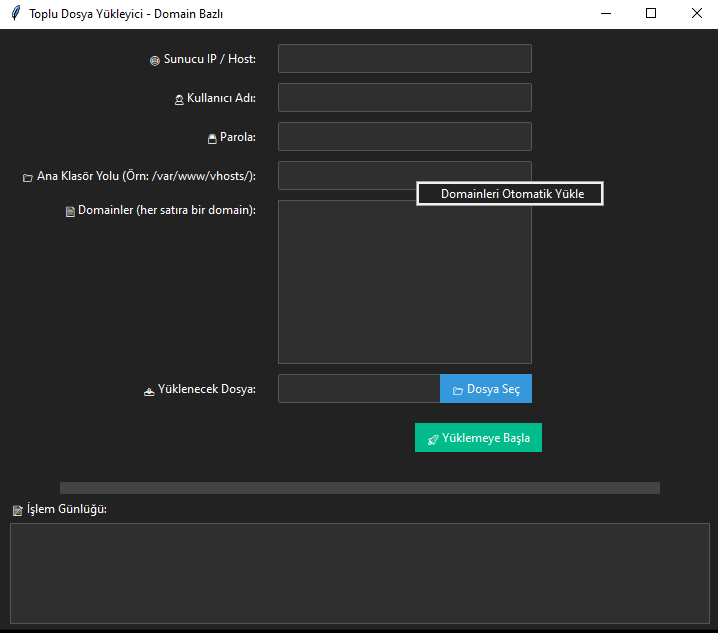

🌐 Domain Bazlı Toplu Dosya Yükleyici 🚀

Bu proje, Python ve Paramiko kullanarak SSH/SFTP üzerinden uzaktaki bir sunucuya toplu dosya yüklemenizi sağlayan,
kullanıcı dostu GUI tabanlı bir uygulamadır.

---

⚙️ Özellikler

- Güvenli SSH bağlantısı (port 22)
- Yerel dosyadan kolay yükleme
- Domain listesi elle girilebilir veya uzak sunucudan otomatik çekilebilir
- Ana klasör yolu belirlenebilir (örn: /var/www/vhosts/)
- Sağ tık menüsü ile otomatik domain listeleme
- İlerleme çubuğu ile yükleme durumu takip edilir
- Detaylı işlem günlüğü
- Modern karanlık temalı GUI
- Çoklu iş parçacığı ile arayüz donmaz

---

📸 Ekran Görüntüsü

---
💻 Kurulum ve Kullanım

Gereksinimler:
- Python 3.7+
- Paramiko
- ttkbootstrap

pip install paramiko ttkbootstrap

Çalıştırmak için:

python domain_file_uploader.py

Kullanım:

1. Sunucu IP/Host, kullanıcı adı ve parolayı girin.
2. Ana klasör yolunu belirtin.
3. Sağ tık ile otomatik domain yükleme yapabilir veya domainleri elle yazabilirsiniz.
4. Yüklenecek dosyayı seçin.
5. "Yüklemeye Başla" butonuna basın.
6. İşlem günlüğünden sonuçları takip edin.

---

🛠️ Kod Yapısı

- DosyaYukleyiciApp: Tkinter ve ttkbootstrap ile GUI.
- SSH bağlantısı ve dosya transferi paramiko ile.
- İlerleme ve işlem günlüğü arayüzde anlık güncellenir.
- Sağ tık menüsü ile ek kolaylıklar.

---

📜 Lisans

MIT Lisansı

---

🤝 Katkıda Bulunmak İster misiniz?

Issue açabilir veya pull request gönderebilirsiniz.

---

Teşekkürler!

---

Repo Linki:  
https://github.com/ebubekirbastama/domain-batch-file-uploader/
